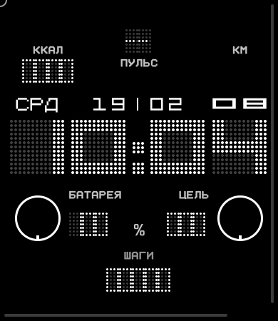
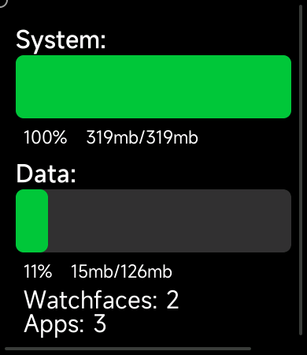

# [EN] MiWatchEmuScreenshot
Util for [MiWatchEmulator](https://github.com/m0tral/MiWatchEmulator) Xiaomi Watches emulator.

Usefull to take real screenshot of watchfaces or apps.

### Usage is very simple:
just copy `MiWatchEmuScreenshot.exe` in MiWatchEmulator path,  
`adb.exe` should be present here.  
  
To get a screenshot success, your emulator should be online and accessible via adb,  
sometime if may fail, so you need to re-run emulator for that.

It's CLI util, so what you need jump run it  
and it will create automatically file like this.
```
screenshot_20250219_012625.bmp.
```
Watch model, i.e. resolution, detects automatically.

# [RU] MiWatchEmuScreenshot

Утилита для эмулятора [MiWatchEmulator](https://github.com/m0tral/MiWatchEmulator) часов Xiaomi.

Полезная вещь для получения скришотов как реально на часах  
для циферблатов и приложений.  

### Использование очень простое:
просто скопируйте файл `MiWatchEmuScreenshot.exe` в папку с MiWatchEmulator,  
файл `adb.exe` должен находиться в этой же папке.  

Чтобы успешно сделать скриншот, ваш эмулятор должен быть запущен и доступен через `adb`.  
Если по какой то причине нет связи с эмулятором, его нужно перезапустить.  

Это консольная утилита, поэтому вам нужно просто запустить её,  
и она автоматически создаст файл с именем, как указано тут.
```
screenshot_20250219_012625.bmp.
```
Версия часов определяется автоматически.

# Screenshot Samples
 
